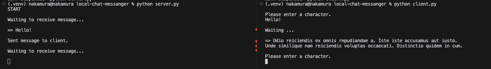

# local-chat-messanger

ソケット通信によりクライアント/サーバー間で情報をやり取りするアプリケーションです。

クライアントからメッセージを送信すると、サーバーからメッセージが返ってきます。

## 実行環境

| サービス | バージョン |
| :---: | :---: |
| macOS | Sonoma 14.1.1 |
| Python | 3.9.16 |

参考: [pyenvでPythonのバージョンを切り替える方法](https://qiita.com/yuya_mtk371/items/08a8fd25a34bd06bf64f)

## 使い方

### 1. clone

```:クローン
git clone https://github.com/YuyaNakamura0139/local-chat-messanger.git
```

### 2. パッケージのインストール

```:pip install
pip install -r requirements.txt
```

### 3. メッセージを入力

以下画像のようにclient側で文字を入力すると、サーバーからメッセージが返ってきます。



### 学び

- ソケット通信を使ったアプリケーションを作成し、クライアント/サーバーモデルの概念を理解する事ができた。